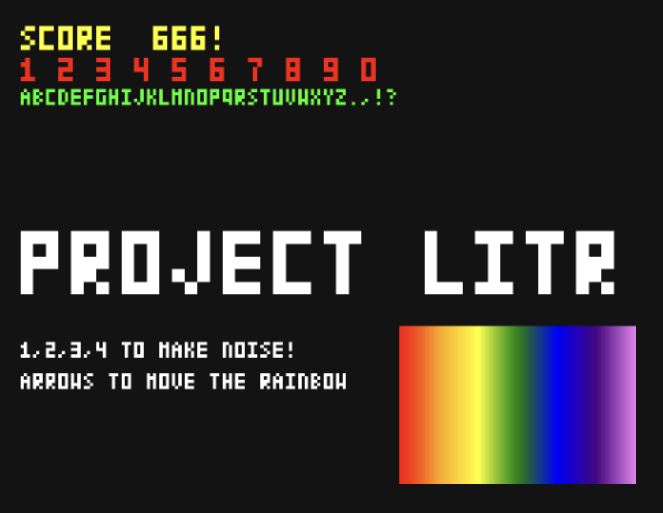

# Untitled (Project Litr)

Game intended for the JS13k gamejam, 2026.
Theme: Rainbows and Unicorns
Constraint: Zipped, this HTML game must be < 13k bytes! That's what makes it fun.

## Game...
Rainbows...Gulfoss from Norse mythology, the rainbow bridge that takes you to Valhalla.

Litr -> Means colorful (rainbow, see!) in old Norse/Icelandic. Also, Litr was a dwarf (or giant in some readings) that met an untimely demise by a kick from Thor into Baldur's funeral pyre (Thor's brother, he was upset).

Unicorn -> The nemesis, must invert expectation.

Idea -> Puzzles like Indiana Jones and the Last Crusade's tile scene where you must step on the correct letters/glyphs, or fall to your doom.

From https://en.wikisource.org/wiki/The_Prose_Edda_(1916_translation_by_Arthur_Gilchrist_Brodeur)/Gylfaginning

"Then was the body of Baldr borne out on shipboard; and when his wife, Nanna the daughter of Nep, saw that, straightway her heart burst with grief, and she died; she was borne to the pyre, and fire was kindled. Then Thor stood by and hallowed the pyre with Mjöllnir; and before his feet ran a certain dwarf which was named Litr; Thor kicked at him with his foot and thrust him into the fire, and he burned. People of many races visited this burning: First is to be told of Odin, how Frigg and the Valkyrs went with him, and his ravens; but Freyr drove in his chariot with the boar called Gold-Mane, or Fearful-Tusk, and Heimdallr rode the horse called Gold-Top, and Freyja drove her cats. Thither came also much people of the Rime-Giants and the Hill-Giants. Odin laid on the pyre that gold ring which is called Draupnir; this quality attended it, that every ninth night there dropped from it eight gold rings of equal weight. Baldr's horse was led to the bale-fire with all his trappings.

## Tools

- `make run` - runs a dev python server on localhost:8000, use from terminal.
- `make build` - runs a naive Python builder, to consolidate to a single html file and make a zip of it.

## Dev log

*GOAL* -> Zero dependency, zero npm install project, use VIM not VSCode.
1. Set up canvas and file basics.
2. Makefile to run Python Server.
3. Audio, generate on the fly, but as it is repeated, generate once and then run as a buffered file, so as not to steal CPU threads/processing from image movement.
4. https://en.wikipedia.org/wiki/Linear-feedback_shift_register Linear Feedback Shift Register for the noise generator, 'Game Boy' style.
5. fonts

How to Edit/Customize Glyphs

Octal digits convert directly to 3-bit binary rows:

    7 = 111 (full row)
    5 = 101 (left & right pixels)
    2 = 010 (center pixel)
    0 = 000 (empty row)

For example, the character 'A' (0o25755) breaks down to:

    2 -> 0 1 0
    5 -> 1 0 1
    7 -> 1 1 1
    5 -> 1 0 1
    5 -> 1 0 1

Day 0 screenshot. Basic setup and init of audio and bitmap font.  